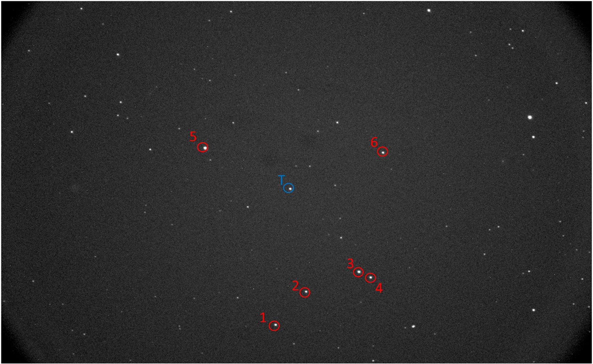

# Exoplanet Transit Photometry

 

## Introduction:

This is a tool for amateur astronomers to locate, observe and fit transit light curves from previously discovered exoplanets. An exoplanet transit occurs when a planet eclipses its host star from the perspective of earth, this will produce small, periodic variations in brightness from the host star that can be graphically conveyed via a transit light curve. Thousands of exoplanets have been discovered using the transit method.
This program will process and normalise transit data to produce a clear transit light curve, it will then perform a multi parameter mcmc fit to return key parameters of the exoplanet such as the radius, semi major axis and inclination. As these are known planets the returned parameters can be compared against those found in professional studies. 
The purpose of this project is to provide easy-to-use transit light curves for amateur astronomers and hobbyists. Hopefully this can inspire interest into exciting and active areas of astronomy, like exoplanets, and demonstrate that these discoveries are far more accessible than people might initially expect. 

## Tutorial:

 

### Step 1: Finding a transit 

The database query tool can be used to access the Nasa exoplanet database and find suitable transiting planets to observe from your local area. 
Inputs and outputs. 
Alternatively, I have provided two separate transits from my own observations which can be found here:
 
WASP-52b:  https://mega.nz/folder/eVs2QZCI#FHtvj8Tk0IrjMUmsh1_uDg
 
TOI-2046b: https://mega.nz/folder/HYkliS4b#i4OzqqvxW0FdLUBCX5osSQ
 

### Step 2: Reference stars 

Once data is acquired, the next step is to select suitable reference stars from your images. The reference stars are extremely important and will greatly affect the quality of the final light curve. I recommend 4-6 reference star. 
A fits file viewer software like ASTAP can be used to select reference stars and find their celestial coordinates. 
 

 
Reference stars should be similar in brightness to that of the target star, which will be the star at the centre of the images. Stars at the edges of the image should be avoided for selection, as small amounts of trailing during observation can cause these stars to leave the frame.  Once stars are selected, note their celestial coordinates (RA, DEC) and update the coordinates.csv file with all reference stars and the target star positions. NOTE: COORDINATES MUST BE GIVEN IN UNITS OF DEGREES. This will mean that you will have to convert Ra from hours to degrees using an online converter. 
To assess the suitability of the chosen reference stars the program will return a plot of normalised flux from each reference star separately, these plots should return a flat trend centred at 1.0, if any other trend is noted the reference star is not applicable and should be removed or replaced. 
 

### Step 3: Parameter File 

Update the parameters.csv file. The target is your planets name and should be given to exactly match the name returned by the Nasa exoplanet database. The reference frame is the frame that the data will be normalised against, I recommend a frame early in the observation before the transit has begun as this will be a measure of your baseline flux. Aperture radius and background are given in pixels. Aperture radius should be enough pixels to encompass the whole star, base this value on your largest star. Aperture background is placed around the aperture radius and should not contain any star contributions. Double the value of aperture radius is usually sufficient, however if two stars are close together, make sure you check that the second star does not fall within the background. 
 

### Step 4: Fitting transit 

Normalisation will be applied to the target star to reveal the transit. The program will then use a multi parameter MCMC fit to generate the best fit parameters. This process will be done automatically and return the best fit transit light curve plot along side the table of initial and fitted parameters. 
Initial guesses for parameters are estimated based on the transit data. This program is intended for a single transit event, therefore there is no way to discern the period which requires measuring the time between multiple transit events. Due to this, the period is queried from the exoplanet database and kept constant to use for producing model light curves. It is not used as a mcmc parameter, as it cannot be reliably constrained and will introduce degeneracy between parameters reducing the overall accuracy by a significant amount. 
 

## Trouble Shooting

If the fit returned is unsatisfactory, the first point of trouble shooting should be the reference stars. Ensure that the coordinates given are accurate to centre pixel of the reference star and given in degrees. 
Otherwise, the data could be too noisy to resolve a transit. In this case try increasing the group_size parameter in increments of 1, this will place data points in groups and average over the group to smooth the signal.
